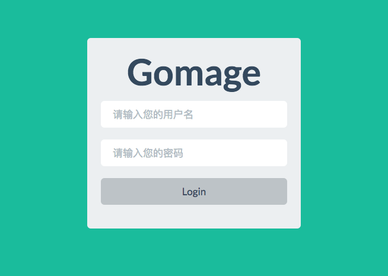
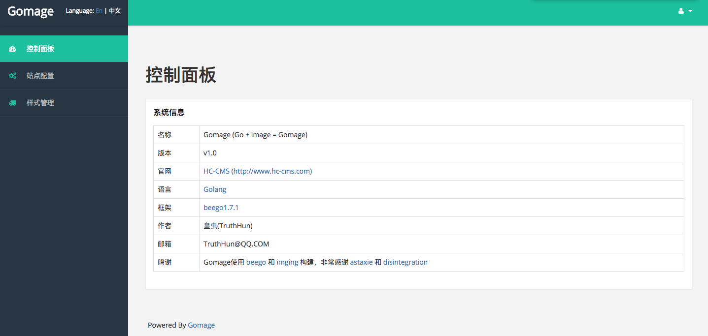
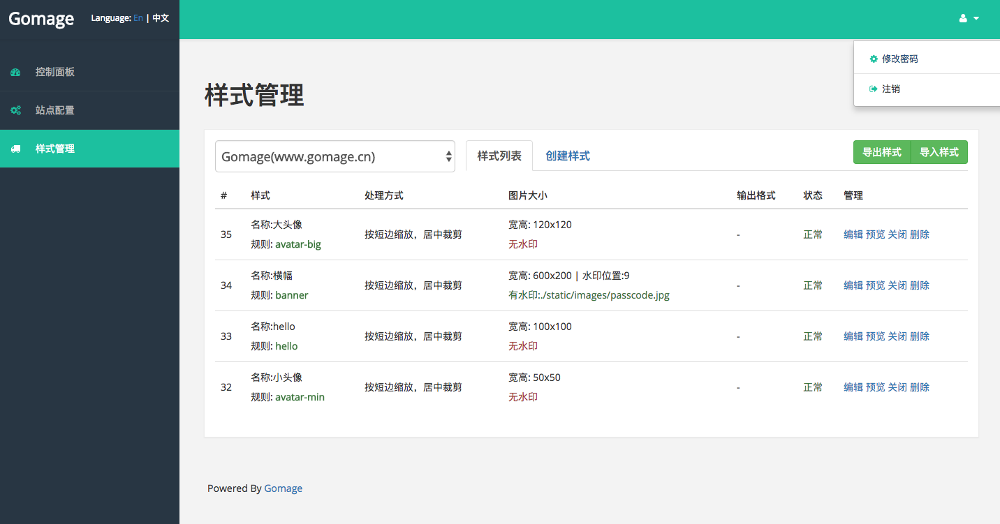
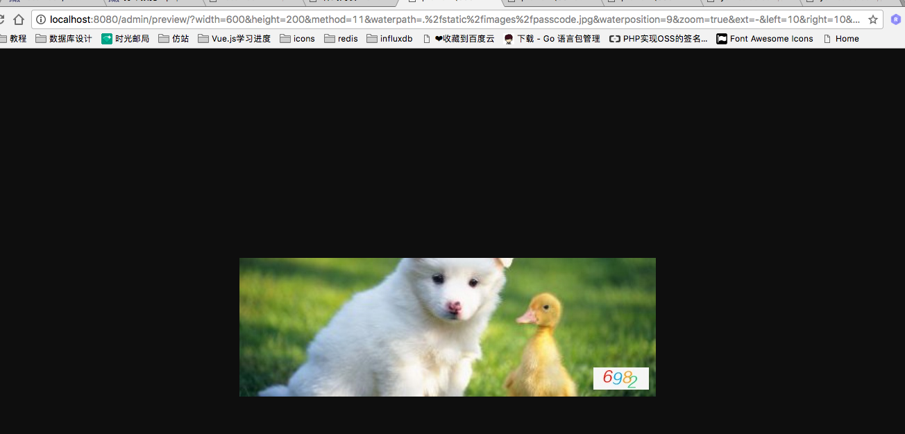
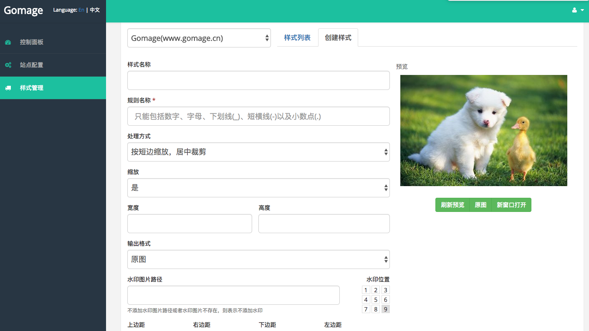

# Gomage

Gomage uses <a href="https://github.com/astaxie/beego" target="_blank">beego</a> and <a href="https://github.com/disintegration/imaging" target="_blank">imging</a> to build, thanks <a href="https://github.com/astaxie" target="_blank">astaxie</a> and <a href="https://github.com/disintegration" target="_blank">disintegration</a> very much

## 程序说明
之前使用阿里云的图片处理服务（https://help.aliyun.com/document_detail/44686.html?spm=5176.doc44687.6.930.5w9idT ），感觉挺方便的。

恰好当时在学习Go语言，所以使用了Go语言(beego框架)实现了一下。目前支持的图片格式有jpg、png、gif、bmp、tif，实现的功能如下：
    
1. 图片信息获取
2. 图片格式转换
3. 图片缩放、裁剪、旋转
4. 图片水印（没有文字水印）
5. 图片配置样式导入导出

## 使用方式

1. 使用 git clone git@github.com:TruthHun/gomage.git ，将项目clone到go开发目录下（建议目录同样为gomage）
2. 修改conf/database.conf下的数据库配置
3. 创建数据库，在数据库中导入MySQL数据，MySQL数据在当前项目的data目录下。
4. 进入gomage项目目录，执行 bee run 命令。（注意：如果运行不成功，提示缺少包(package)，请到http://golangtc.com/download/package 下载）

## 图片访问方式
1. 比如你给站点www.gomage.cn配置了图片样式，样式的规则名为banner，则访问图片的时候，如图片地址为http://www.gomage.cn/example.jpg，如果加上
http://www.gomage.cn/example.jpg@!banner，那么程序就会将图片生成你在样式设置里面的banner图片样式规定的宽高以及缩放规则
2. 获取图片信息，可以通过http://www.gomage.cn/example.jpg@@info的方式，将返回图片的一下基本信息，如图片文件大小、创建时间等。其中@@其实就是一双眼睛，"看"图片info信息

## 页面预览

### 登录页面

### 控制面板

### 域名配置页面

### 样式管理配置页面

### 图片效果预览页面

### 样式创建和配置页面

